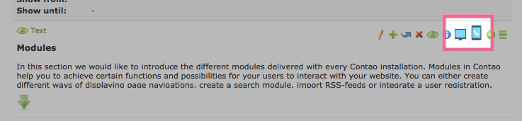
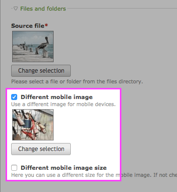
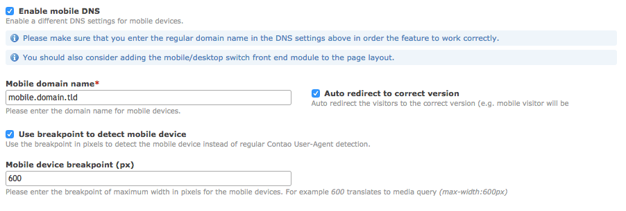

# Mobile Content (mobilecontent)

This extension lets you show or hide specific articles, content elements and frontend modules on mobile or desktop devices.
Image fields are extended – you can now add an different image for the mobile devices.


It works out of the box by recognizing the visitor user agent and displaying the appropriate content. 
For use with CDN that caches the pages you may want to enable a separate mobile domain though (see explanation below).

The extension is compatible with Contao 3 and 4. 

## Toggle the content

To toggle the content you can either edit the element settings or simply use the icons available in the list view:



## Differen mobile image

To use a different image for mobile devices check `Different mobile image` on any elment with an image.




## Mobile domain
 
In the website root settings you can enable the special domain for the mobile devices:



If mobile domain is enabled mobile and desktop layout will be distinguished by domain only.

### Front end module

To allow easy switch between the desktop and mobile domains you can add the mobile/desktop switch front end module that displays
a short information about the parallel domain and allows the visitors to switch to the correct version of the website
for their device.


### Auto-redirect

When the auto-redirect is enabled, right before the visitor is redirected to the correct version of the page
the script adds the `mobile-content-redirecting` CSS class to the `<body>` element.

**Note:** when this feature is enabled, the toggle links get the extra hash parameter to the URL. When the user
visits a page with that parameter (e.g. by clicking the link) the cookie will be set that prevents from yet another
redirect back. This allows e.g. the mobile visitors to be redirected to the mobile version of the website on first
page view but they can still view the desktop version by explicitly clicking the link.

### mobile/desktop detection by Viewport

If the Contao default mobile/desktop detection by User Agent does not fit your needs, you can alternatively activate detection by viewport width.
As this detection is done by JavaScript, the mobile/desktop switch front end module needs to be added to the layout.


## Insert tags

#### mobile::toggle

Adds a link to toggle between desktop and mobile view. This link carries the classes `mobile_toggle` and `desktop` 
or 'mobile' corresponding to the destination of the link (not the type of page it is on!).

#### mobile::toggle_url

Is replaced by the URL to the currently inactive view mode.

#### mobile::toggle_text

Is replaced by the content of the language variable `$GLOBALS['TL_LANG']['MSC']['toggleDesktop'][0]` or
`$GLOBALS['TL_LANG']['MSC']['toggleMobile'][0]`. This is normally the text of the standard toggle link 
created by `mobile::toggle`.

#### mobile::toggle_title

Is replaced by the content of the language variable `$GLOBALS['TL_LANG']['MSC']['toggleDesktop'][1]` or
`$GLOBALS['TL_LANG']['MSC']['toggleMobile'][1]`. This is normally the title of the standard toggle link 
created by `mobile::toggle`.

#### mobile::alternatives::alternative_desktop:alternative_mobile

This insert tags shows only one of the two alternatives `alternative_desktop` or `alternative_mobile` depending on 
which type of view is currently active. *Note:* there is a single semicolon between the two last chunks in the insert tag.

#### ifmobile […] endifmobile, ifndesktop […] endifndesktop

The content between the start and and tag is skipped if it appears on a desktop page.

#### ifdesktop […] endifdesktop, ifnmobile […] endnifmobile

The content between the start and and tag is skipped if it appears on a mobile page.


## Developers

To check if the current page is mobile:

```php
$GLOBALS['objPage']->isMobile
```

Example for the templates:

```php
<?php if ($GLOBALS['objPage']->isMobile): ?>
    mobile content
<?php else: ?>
    desktop content
<?php endif; ?>
```
